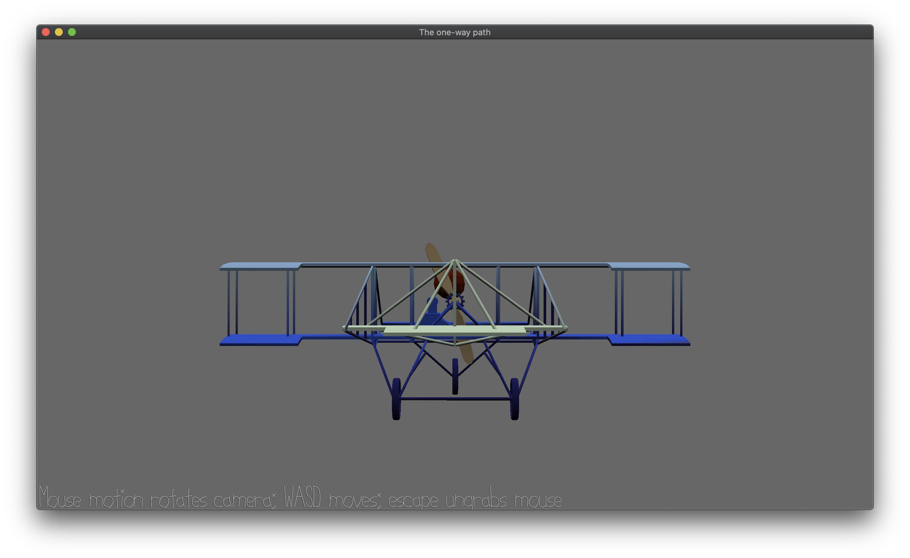

# The one-way path

Author: Zhengjia Cao

Design: There is no winning or losing in the game. It is about an endless flight with sounds. 

Screen Shot:



How To Play:

```
sh run.sh
```

Push the space button to start the game (please keep the button pushed down, the stones will appear after 15s of flight). If you are tired of this, just stop pushing the space button. Everything will be paused except for the calming background music. The desgined of the game is inspired by the game *LONER*. Similar to loner, there is no upgrade or score in the game. As the developers of LONER described, the goal of their game is to discover the feeling of tranquillity and loneliness:

> "What is loneliness...It is like going to a 7-24 convienient store at midnight. The store is so bright but there is few people in it. You grab your things and go home. You open the light. You don't want to talk to anyone, and you are not in a happy mood, but you just feel cozy."

At the time of writing this game, I am suffering under pressure. I feel lost and not having a purpose of life. Words coming towards me are just rejections and objections. I feel everything I was passionate about means nothing to others. I wish I can pause the time for a while. Do nothing. Just to get lost in the music. But in the end, you get to choose if you would like to continue your flight or just quit the game.

There is no obvious state change in game. No ending. No purpose. No need to focus. You can use arrow keys (up, down, left, right) to control the plane to do rotation, but very unlikely you will hit a stone so just enjoy your flight. If you luckily run into a stone coming towards you, you will move backward for a short distance and continue flying. Like almost everything, you act of hiding from the stone won't be successful. It is designed to be a deterministic manner. Just accept it. 

Oh just one more thing, if you hold the space button for too long, the screen will go dark. Give yourself a little rest and get the light back.


Sources:
- Plane Model: https://www.turbosquid.com/3d-models/free-x-mode-old-duigan-pusher/1094564
- Music (Background) : https://audionautix.com/ Creative Commons Music by Jason Shaw on Audionautix.com
- Game idea: Inspired by LONER. https://apps.apple.com/cn/story/id1390370206 (Story in Chinese)

This game was built with [NEST](NEST.md).

